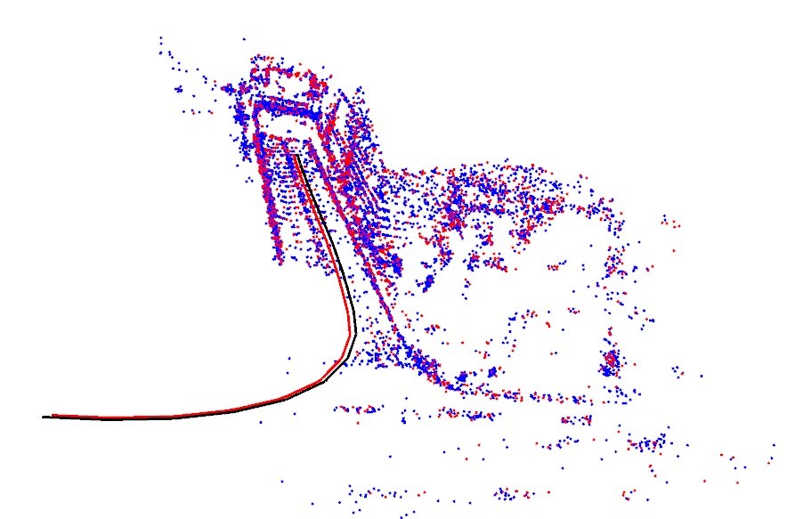

# LidarStereoRe
This is my undergraduate graduation design project : The Dense 3D Reconstruction of Lidar Stereo Joint.


### 依赖

#### ros

#### pangolin

#### Eigen

#### Opencv

#### yaml-cpp


### 1.StereoFeature

```
roslaunch LidarStereoRe StereoFeature.launch
```

- 输入

  - rosbag - 双目图像
  - yaml - 标定参数
  - pose - 激光里程计获得的pose

- 输出

  - 可视化结果

    

    红色曲线：相机轨迹

    黑色曲线：激光轨迹

    蓝色地图点和红色地图点的区别：红色地图点表示被观测次数更多

  - 地图点以及观点帧参数输出,提供给优化进一步处理

    - GoodMapPoints.txt
    - GoodFrames.txt
    - kFrames.txt
    - LidarNearFrame.txt
    - MapPoints.txt

    

### 2.Optimizer

